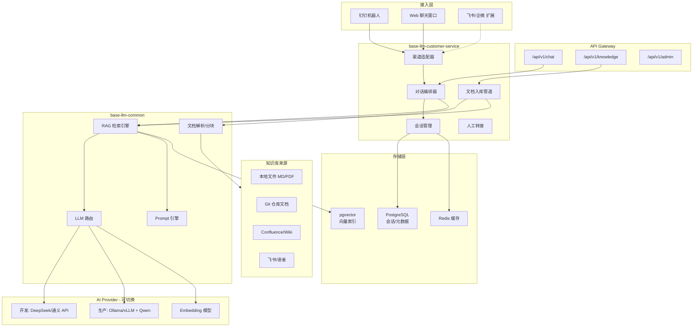
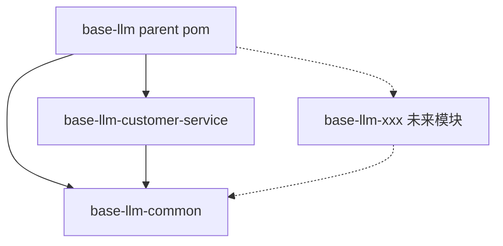
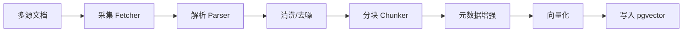

# base-llm

面向研发中心的多模块大模型应用平台。首个业务子模块 **base-llm-customer-service** 实现基于 RAG 的智能技术运维客服，公共 LLM 能力沉淀在 **base-llm-common**，便于后续扩展更多大模型项目。

## 业务定位

智能客服机器人面向研发中心日常技术运维场景，结合公司技术知识库与大模型能力，解决：

- 环境配置、部署流程、CI/CD 规范查询
- 常见故障自助排查
- 新人 onboarding 技术问答
- 无法回答时转人工（规划中）

## 整体架构



## 工程结构

```
base-llm/                                    # 根 POM（packaging: pom）
├── pom.xml                                  # 父 POM：版本管理、Spring AI BOM
├── docker-compose.yml                       # PostgreSQL + Redis 本地开发
├── base-llm-common/                         # 公共模块（jar，不可独立运行）
│   └── src/main/java/com/jiwei/base_llm/common/
│       ├── ai/            # LLM 路由
│       ├── rag/           # RAG 检索与生成
│       ├── vector/        # VectorStore 封装
│       ├── prompt/        # Prompt 模板引擎
│       ├── parser/        # 文档解析与分块
│       └── model/         # 跨模块共享 DTO
└── base-llm-customer-service/               # 智能客服（可独立运行）
    └── src/main/java/com/jiwei/base_llm/customer/
        ├── CustomerServiceApplication.java
        ├── config/
        ├── controller/
        ├── service/
        ├── channel/       # 钉钉/Web 渠道适配
        ├── model/
        └── repository/
```

### 模块职责

| 模块 | artifactId | 类型 | 职责 |
|------|------------|------|------|
| 根工程 | `base-llm` | parent pom | 统一版本、依赖管理、构建配置 |
| 公共模块 | `base-llm-common` | jar | LLM 路由、RAG 管道、文档解析、Prompt 等可复用能力 |
| 智能客服 | `base-llm-customer-service` | 可执行 jar | 会话、渠道、知识库管理、转人工 |
| 未来模块 | `base-llm-*` | 按需 | 其他大模型应用，依赖 common |

### 模块依赖关系



**设计原则：**

- `common` 不依赖任何业务模块
- 各业务模块独立启动、独立部署
- 业务模块之间禁止互相依赖，共享逻辑下沉到 `common`

## 技术选型

| 层级 | 选型 | 说明 |
|------|------|------|
| 语言 / 框架 | Java 21 + Spring Boot 3.5.14 | 基础运行环境 |
| AI 框架 | Spring AI 1.1.2 | Chat / Embedding / VectorStore 统一抽象 |
| LLM 开发 | DeepSeek API / 通义千问 API | 开发环境，成本低、中文效果好 |
| LLM 生产 | Ollama / vLLM + Qwen2.5 | 私有化部署，数据不出域 |
| Embedding | text-embedding-3-small / BGE-M3 | API 或本地模型 |
| 向量库 | PostgreSQL + pgvector | 与业务库合一，运维简单 |
| 关系库 | PostgreSQL | 会话、消息、反馈、文档元数据 |
| 缓存 | Redis | 会话上下文、检索结果缓存 |
| 文档解析 | Apache Tika | MD / PDF / Word / HTML |
| 钉钉接入 | dingtalk-stream | Stream 模式，无需公网回调 |
| API 文档 | springdoc-openapi | Swagger UI |

## RAG 流程

### 文档入库



**分块策略：**

- 按 Markdown 标题层级切分，保留章节路径
- Chunk 大小 800 tokens，overlap 128 tokens
- 元数据：`documentId`、`documentTitle`、`sourceType`、`sourceUrl`、`sectionPath`

### 问答检索

```
用户提问
  → Query 改写（结合对话历史）
  → 向量检索 Top-K
  → Prompt 组装（System + 检索上下文 + 用户问题）
  → LLM 生成（支持流式）
  → 引用标注 + 置信度评估
  → 低置信度提示转人工
```

## 快速开始

### 环境要求

- JDK 21+
- Maven 3.9+
- Docker（dev 环境，用于 PostgreSQL + Redis）

### 构建

```bash
./mvnw clean verify
```

### 本地开发（无需 Docker）

使用 H2 内存数据库 + 内存向量库，适合快速体验：

```bash
export DEEPSEEK_API_KEY=your-api-key

cd base-llm-customer-service
../mvnw spring-boot:run -Dspring-boot.run.profiles=local
```

### 开发环境（PostgreSQL + pgvector）

```bash
# 启动基础设施
docker compose up -d

# 配置 LLM API Key
export DEEPSEEK_API_KEY=your-api-key

# 启动服务
cd base-llm-customer-service
../mvnw spring-boot:run -Dspring-boot.run.profiles=dev
```

服务默认端口：`8080`

Swagger UI：http://localhost:8080/swagger-ui.html

### 生产环境（私有化 LLM）

```bash
../mvnw spring-boot:run -Dspring-boot.run.profiles=prod
```

生产环境默认使用 Ollama + Qwen2.5，需在 `application-prod.yaml` 中配置 Ollama 地址。

## 配置说明

### Profile 说明

| Profile | 用途 | 数据库 | 向量库 | LLM |
|---------|------|--------|--------|-----|
| `local` | 本地快速体验 | H2 | SimpleVectorStore | DeepSeek API |
| `dev` | 开发联调 | PostgreSQL + pgvector | pgvector | DeepSeek API |
| `prod` | 生产部署 | PostgreSQL + pgvector | pgvector | Ollama / vLLM |
| `test` | 单元测试 | H2 | SimpleVectorStore | Mock |

### 环境变量

| 变量 | 说明 |
|------|------|
| `DEEPSEEK_API_KEY` | DeepSeek API Key（dev/local 环境） |
| `DINGTALK_ENABLED` | 是否启用钉钉机器人（`true`/`false`） |
| `DINGTALK_CLIENT_ID` | 钉钉应用 ClientId / AppKey |
| `DINGTALK_CLIENT_SECRET` | 钉钉应用 ClientSecret / AppSecret |

### 钉钉机器人启用

```yaml
dingtalk:
  enabled: true
  client-id: ${DINGTALK_CLIENT_ID}
  client-secret: ${DINGTALK_CLIENT_SECRET}
```

## API 接口

| 方法 | 路径 | 说明 |
|------|------|------|
| GET | `/api/v1/health` | 健康检查 |
| POST | `/api/v1/knowledge/documents/upload` | 上传文档入库 |
| GET | `/api/v1/knowledge/documents` | 文档列表 |
| DELETE | `/api/v1/knowledge/documents/{id}` | 删除文档及向量 |
| POST | `/api/v1/chat/completions` | RAG 问答 |
| POST | `/api/v1/chat/completions/stream` | SSE 流式问答 |
| GET | `/api/v1/chat/sessions/{id}` | 获取会话历史 |
| POST | `/api/v1/chat/feedback` | 提交回答反馈 |

### 示例：上传文档

```bash
curl -X POST http://localhost:8080/api/v1/knowledge/documents/upload \
  -F "file=@docs/deploy-guide.md"
```

### 示例：RAG 问答

```bash
curl -X POST http://localhost:8080/api/v1/chat/completions \
  -H "Content-Type: application/json" \
  -d '{
    "message": "如何申请测试环境？",
    "userId": "user001"
  }'
```

## 数据模型

| 表 | 说明 |
|----|------|
| `chat_session` | 会话（用户、渠道、状态） |
| `chat_message` | 消息（角色、内容、引用、置信度） |
| `chat_feedback` | 用户反馈（有帮助/无帮助） |
| `kb_document` | 知识库文档元数据 |
| pgvector 向量表 | 文档分块 embedding（由 Spring AI 管理） |

## 扩展新的大模型项目

1. 在根 `pom.xml` 的 `<modules>` 中添加新模块
2. 新建子模块，`pom.xml` 中依赖 `base-llm-common`
3. 实现业务逻辑，复用 common 的 LLM / RAG 能力
4. 独立配置、独立部署

```xml
<dependency>
    <groupId>com.jiwei</groupId>
    <artifactId>base-llm-common</artifactId>
</dependency>
```

## 落地路线图

| 阶段 | 状态 | 内容 |
|------|------|------|
| Phase 0 | 已完成 | 多模块 Maven 工程骨架 |
| Phase 1 | 已完成 | RAG 核心、Web API、钉钉骨架、会话与反馈 |
| Phase 2 | 规划中 | 多源采集（Git/Confluence/飞书）、Hybrid Search、Rerank、转人工 |
| Phase 3 | 规划中 | 私有化部署、监控告警、Admin 后台、K8s |
| Phase 4 | 规划中 | 飞书/企微渠道、意图分类、工单集成 |

## 成功指标

- 回答准确率（「有帮助」反馈率）> 75%
- 自助解决率（无需转人工）> 60%
- 首 token 延迟 < 2s（API）/ < 5s（本地）
- Top 50 高频问题知识库覆盖率 > 90%

## License

Apache 2.0
